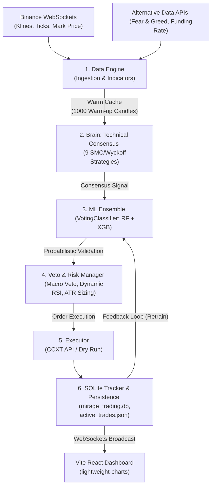

# 📊 Mirage Trading — Algorithmic Trading Platform (Institutional Grade)

**Mirage Trading** is a high-performance autonomous algorithmic trading engine designed for quantitative speculation on perpetual futures contracts (Binance Futures). The system integrates state-of-the-art cooperative Artificial Intelligence models with multi-segment technical analysis, adaptive risk management, and production-grade persistence to trade robustly and uninterruptedly.

---

## 🎯 Core Pillars

* **Cooperative AI Ensemble:** Implements a hybrid `VotingClassifier` (Random Forest + XGBoost) auto-optimized via genetic algorithms (`Optuna`) that acts as a probabilistic validator of technical entries, reducing false signals to historic lows.
* **Multidimensional Technical Consensus:** Evaluates market conditions through 9 independent modular strategies (SMC, Wyckoff, Orderflow Delta, ATR Volatility, Price Action) across synchronized timeframes (15m, 1h, 4h) to ensure the bot only operates in the direction of the macro trend.
* **Augmented Data Processing:** Combines pure market metrics with **Alternative Data** (real-time Funding Rates and the global Fear & Greed index) to capture both technical liquidity and institutional sentiment/positioning.
* **Production-Grade Concurrency & Mitigation:** Shielded against database write locks using dynamic connection queue queuing (`SQLite timeout`), credentials sanitization to prevent leaks, and automatic active trades JSON serialization for state survival during restarts.

---

## 📁 Project Architecture

```
chaguan17-mirage-trading/
├── Backend/          → Trading Engine (Python + FastAPI)
├── Frontend/         → Dashboard (React + Vite)
└── Config files      → Dependencies and configuration
```

### Tech Stack

**Backend:**
- `fastapi` - REST API
- `ccxt` - Binance REST Connection
- `websocket-client` - Binance Streams
- `sklearn` & `xgboost` - Machine Learning Ensemble
- `optuna` - Auto-Optimization Genetic Algorithms
- `sqlite3` - Robust Data Storage
- `pandas` / `numpy` - Data processing

**Frontend:**
- `React 18+`
- `lightweight-charts` - TradingView financial charts
- `WebSockets` - Real-time market data

---

## 🧠 Core Components

### 1. **Mirage Brain & ML Engine (AI System)**
The heart of the bot. It evaluates market conditions through three layers:
- **Consensus Voting**: Aggregates signals from 9 strategies (Trend, SMC, Wyckoff, OrderFlow, etc.).
- **Ensemble Classifier (NEW)**: A `VotingClassifier` combines `RandomForest` and `XGBoost`. Both models must independently agree to buy, drastically reducing false positives.
- **Veto System**: Blocks trades if global BTC trend is crashing or if the predicted success probability is too low.

### 2. **Advanced Risk Manager**
- **Smart Sizing**: Position size calculated based on balance and real buying power.
- **Martingale**: Configurable risk multiplier after losses to recover capital quickly.
- **Protections**: 
  - **Breakeven**: Moves SL to entry price at 50% TP progress.
  - **Trailing Stop**: Pursues profit using ATR-based dynamic distance.
  - **Intelligent Scale-In (DCA)**: Up to 3 "bullets" to improve entry price during pullbacks, only triggered if the AI spots a divergence.

### 3. **Market Stream & Data Engine**
- **Zero Latency**: Subscribed to Binance WebSocket Streams (`@kline_1m`, `@markPrice`), dropping REST API usage by 99%.
- **Alternative Data**: Feeds the neural network not just with OHLCV, but with the **Funding Rate** and the global **Fear & Greed Index** to gauge institutional sentiment.

### 4. **SQLite Tracker & Optuna Optimizer**
- Replaced legacy JSON/CSV storage with a robust transactional SQLite database (`mirage_trading.db`).
- **Auto-Tune Engine**: A standalone `optimizer.py` script uses Optuna and historical SQLite data to genetically find the most profitable hyper-parameters for the ML models.

---

## 💻 Professional Dashboard

- **TradingView Integration**: The old equity curve has been replaced by `TradingChart.jsx`, drawing real-time candlesticks, Entry levels, Take Profits, and Stop Losses explicitly on the chart.
- **Bi-Directional Control**: Includes a "PANIC SELL" button to force-close the entire active fleet directly from the UI.
- **Glassmorphism Settings**: Beautifully redesigned Settings UI allowing strategy toggling and parameter tweaking without touching any code.

---

## 🔄 Operational Process Flow

The bot runs a continuous real-time decision loop structured into the following operational phases:



---

## 🔐 Security, Concurrency & Stability (Senior Audit Overhaul)

The bot has been shielded against production operational issues and security vulnerabilities:
- **Credential Masking:** Automatically masks private `API_KEY` and `API_SECRET` (`********`) in REST API and WebSockets dashboard payloads to prevent credential leaks.
- **Active Trades File-Based Persistence:** The tracker serializes the state of open positions in real-time to local JSON files (`storage/active_trades_{symbol}.json`). Upon restart, the bot automatically restores these positions, preventing them from being orphaned in the exchange.
- **SQLite Concurrency Lock Mitigation:** Added `timeout=15.0` to all database connections in the bot and API, allowing multi-process database queues without concurrent locking crashes.
- **SQL Injection Prevention:** Sanitized and parameterized database queries in `trainer.py` using native placeholders (`params=(symbol,)`).
- **Robust Indicator Warm-up:** Increased the initial historical candle limits from 200 to 1000. This ensures indicator warm-up for `EMA_200` and `VWAP_100` does not empty RAM caches, allowing new pairs to be processed with maximum precision.
- **Core Protections:**
  - **Paper Trading by default**: Safe environment for AI learning.
  - **Margin Awareness**: The bot tracks used vs. available margin to prevent over-leveraging.
  - **Sleep Cycles**: Automatic nightly maintenance.
  - **Hot-Reload**: Parameters can be updated from the UI without stopping the engine.

---

## 🎓 Conclusion

**Mirage Trading** has moved from an experimental setup to an institutional-grade algorithmic trading bot. The addition of XGBoost, Optuna, Alternative Data, SQLite, and WebSockets makes it extremely resilient and intelligent.

> **Recommendation**: Let the bot run in Paper Trading mode to build a massive dataset, and run `optimizer.py` every weekend to naturally evolve its neural pathways.