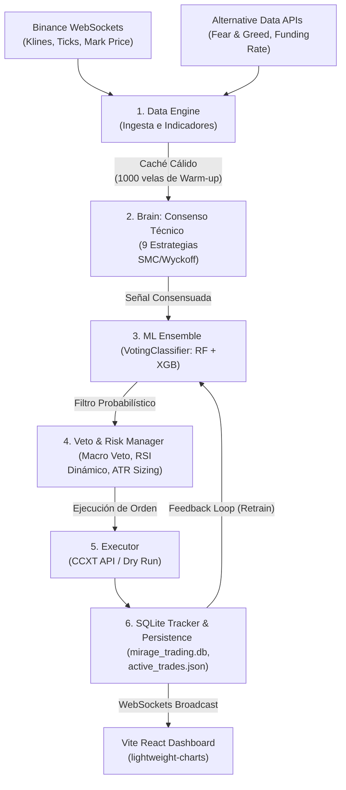

# MIRAGE TRADING

> Bot de trading algorítmico autónomo para futuros de criptomonedas

---

## 🎯 Pilares del Sistema

* **Ensamble de IA Cooperativo:** Implementa un `VotingClassifier` híbrido (Random Forest + XGBoost) auto-optimizado mediante algoritmos genéticos (`Optuna`) que actúa como validador probabilístico de las entradas técnicas, reduciendo las señales falsas a mínimos históricos.
* **Consenso Técnico Multidimensional:** Evalúa el mercado a través de 9 estrategias modulares independientes (SMC, Wyckoff, Orderflow Delta, Volatilidad ATR, Acción del Precio) sobre timeframes sincronizados (15m, 1h, 4h) para asegurar que el bot opera solo a favor de la tendencia macro.
* **Procesamiento de Datos Aumentado:** Combina métricas puras de mercado con **Datos Alternativos** (Funding Rates en tiempo real e índice de Fear & Greed) para capturar tanto la liquidez técnica como el sentimiento y posicionamiento institucional.
* **Mitigación y Resiliencia en Producción:** Blindado contra problemas concurrentes de escritura en base de datos mediante encolamiento dinámico (timeout de SQLite), sanitización de API Keys contra fugas y restauración automática de posiciones abiertas mediante almacenamiento persistente JSON ante caídas de servicio.

---

##  Visión General

**Mirage Trading** es un sistema completo de trading algorítmico que opera en **Binance Futures** de forma autónoma. Combina **9 estrategias técnicas** con un motor de **Machine Learning adaptativo** que aprende de cada operación, gestionando el riesgo de forma dinámica según el capital disponible en tiempo real.

El sistema no depende de intervención humana. Analiza el mercado, toma decisiones, gestiona posiciones abiertas y se reentrena automáticamente cada noche.

**Backend:**
- `fastapi` - API REST
- `ccxt` - Conexión con Binance
- `websocket-client` - Binance Streams
- `sklearn` & `xgboost` - Machine Learning Ensemble
- `optuna` - Algoritmos Genéticos de Auto-Optimización
- `pandas` / `numpy` - Manipulación de datos
- `sqlite3` - Base de datos

**Frontend:**
- `React 18+` + `React Router DOM`
- `Vite` - Build tool
- `lightweight-charts` - Gráficas de TradingView interactivas
- `WebSockets` - Datos en tiempo real

### Stack principal

## 🧠 Componentes Clave del Backend

### 1. **api.py** - Servidor FastAPI
**Responsabilidades:**
- Servir datos al Frontend vía SQLite y WebSockets.
- Endpoint bidireccional `/api/commands` (Ej. Botón del Pánico).

### 2. **market_stream.py** - Gestor de WebSockets (NUEVO SPRINT 2/4)
- Mantiene conexión viva con `fstream.binance.com`.
- Descarga velas, Funding Rate (`@markPrice`) y Open Interest en vivo.
- Reduce el consumo de la API REST en un 99%.

### 3. **brain.py & ml_engine.py** - Sistema de IA Híbrido (NUEVO SPRINT 4)
El corazón del bot ha evolucionado de un simple modelo a un **Ensamble Institucional**:
- **VotingClassifier:** Combina Random Forest y XGBoost. Ambos modelos deben dar señal de compra simultáneamente para entrar al mercado.
- **Optuna Optimizer:** Script dedicado (`optimizer.py`) que usa algoritmos genéticos los fines de semana para encontrar los hiperparámetros perfectos.

### 4. **data_engine.py** - Motor de Datos Aumentado
Aparte del análisis técnico clásico (RSI, EMA, ATR, MACD, Orderflow, Wyckoff), ahora inyecta **Datos Alternativos**:
- **Fear & Greed Index:** Sentimiento global desde `alternative.me`.
- **Funding Rate:** Tasa de financiación extraída de WebSockets.

### 5. **risk_manager.py** - Gestión de Riesgo
- **Position Sizing dinámico** basado en % de capital.
- **Stop Loss** dinámico (basado en ATR) y Breakeven automático.
- **Scale-In (DCA) Inteligente**: Solo promedia si la IA lo aprueba.
- **Martingala limitable**.

### 6. **executor.py & tracker.py** - Ejecutor y Registro (SQLite)
- Abre/cierra posiciones reales o paper.
- Registra todo transaccionalmente en `mirage_trading.db`.

---

## 💻 Frontend - Dashboard React

### Componentes principales:

**Dashboard Component**
- **TradingChart (NUEVO SPRINT 3):** Gráfica interactiva de TradingView (`lightweight-charts`) que dibuja tus puntos de entrada, SL y TP explícitamente en el gráfico. Escala dinámicamente según los decimales de la criptomoneda.
- **Panel Bidireccional:** Botón de "PANIC SELL" para forzar el cierre de toda la flota.

**SettingsView Component**
- Panel de cristal (Glassmorphism) para encender/apagar estrategias dinámicamente y ajustar modificadores (ej. Multiplicador de ATR) sin tocar código.

---

## 🔐 Seguridad, Concurrencia y Estabilidad (Auditoría Senior)

El bot ha sido blindado contra fallas operativas y vulnerabilidades comunes en entornos de producción:
- **Protección de Credenciales (Masking):** Enmascaramiento automático de las llaves `API_KEY` y `API_SECRET` (`********`) en las respuestas JSON de la API REST y del WebSocket del dashboard para prevenir fugas accidentales.
- **Persistencia de Operaciones Activas:** El tracker ahora guarda en tiempo real el estado de las posiciones abiertas en archivos locales JSON en `storage/active_trades_{symbol}.json`. Al reiniciarse, el bot recupera estas posiciones automáticamente evitando que queden huérfanas en el exchange.
- **Mitigación de Bloqueos en SQLite:** Configurado un `timeout=15.0` en todas las conexiones a la base de datos `mirage_trading.db` en el bot y en la API, permitiendo lecturas/escrituras multiproceso encoladas de forma segura.
- **Prevención de Inyección SQL:** Sanitización y parametrización de las consultas en el reentrenamiento nocturno (`trainer.py`) utilizando parámetros de enlace nativos (`params=(symbol,)`).
- **Warm-up de Datos Robusto:** Incrementado el límite de descarga de velas inicial de 200 a 1000. Esto asegura que la limpieza de celdas vacías (`dropna`) no vacíe la memoria RAM de indicadores críticos como `EMA_200` y `VWAP_100`, permitiendo que los nuevos pares se evalúen con total precisión.

---

## 🚀 Estado del Desarrollo

### ✅ SPRINT 1, 2 & 3: COMPLETADO
- [x] Conexión blindada a Binance API (REST y WebSockets)
- [x] Paper Trading (simulación)
- [x] Inteligencia de Mercado (Veto Engine, Multi-TF 15m/1h/4h)
- [x] Risk Manager Avanzado (ATR Trailing Stop, DCA Inteligente)
- [x] Migración Completa a SQLite (`live_state` y `history`)
- [x] UI/UX Profesional (TradingView, Botón de Pánico, Ajustes Dinámicos)

### ✅ SPRINT 4: COMPLETADO
- [x] Ensamble IA (XGBoost + Random Forest en Voting Classifier)
- [x] Ingesta de Datos Alternativos (Funding Rate, Fear & Greed Index)
- [x] Script de Auto-Optimización (Optuna)

---

## 🔄 Flujo del Proceso Operativo

El bot ejecuta un bucle de decisión continuo en tiempo real estructurado en las siguientes fases:

---

## 🎓 Conclusión

**Mirage Trading** ha superado su fase experimental y cuenta ahora con un esqueleto **de grado institucional**. Las reducciones drásticas en latencia (WebSockets), el salto en robustez predictiva (XGBoost + Optuna + F&G Index) y su persistencia segura (SQLite) lo convierten en un algoritmo formidable.

**Próximos pasos recomendados:**
- Dejar que el bot corra en Paper Trading (Live) por semanas para generar un dataset orgánico.
- Ejecutar `optimizer.py` los domingos para afilar las neuronas.
- (Opcional) Desarrollar módulo de Backtesting Formal.
